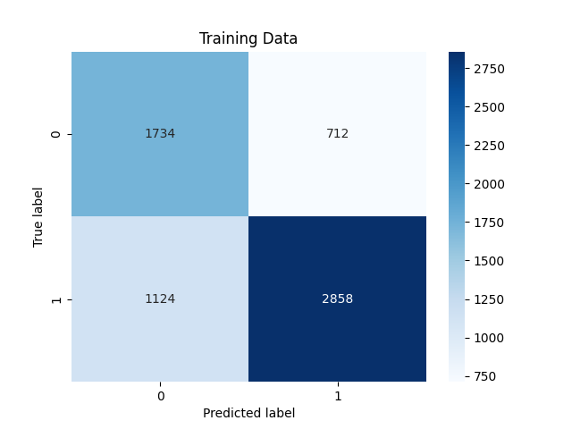

<h1>S&P 500 trend prediction</h1>

<h2>Description</h2>
Trained a Random Forest to predict if the S&P will be above it's 20 simple moving average in five days time.
<h2>Results</h2>
Test Accuracy: 76% 
Test Precission: 85%  
Classification Matrix:

<h2>Languages and Utilities Used</h2>

- <b>Python</b>

